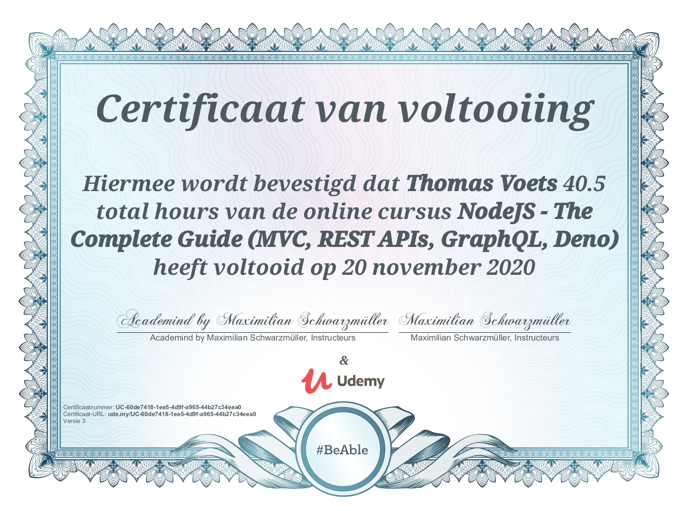

# NodeJS Complete Guide

This repository contains the algorithms, resources and documents used during the course: [NodeJS - The Complete Guide (MVC, REST APIs, GraphQL, Deno)](https://www.udemy.com/course/nodejs-the-complete-guide/)

## Mastering NodeJS

- Work with one of the most in-demand web development programming languages
- Learn the basics as well as advanced concepts of NodeJS in great detail
- Build modern, fast and scalable server-side web applications with NodeJS, databases like SQL or MongoDB and more
- Understand the NodeJS ecosystem and build server-side rendered apps, REST APIs and GraphQL APIs
- Get a thorough introduction to DenoJS

## Certificate of Completion

